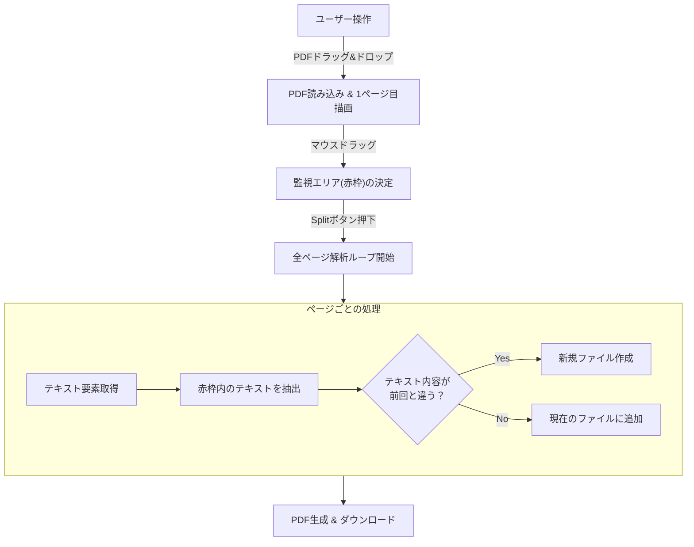
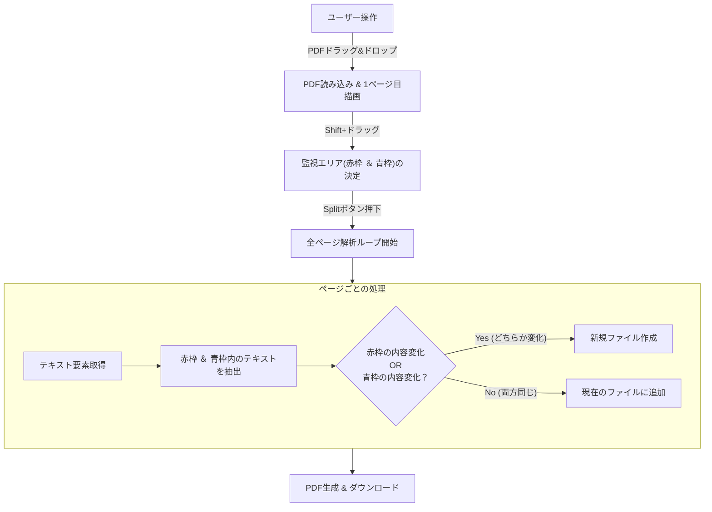

# PDF Text Splitter (Experimental)

[**👉 実際に動くデモページはこちら**](https://check5004.github.io/pdf-text-splitter/public/)

このプロジェクトは、PDF内の「特定の位置にあるテキスト」の変化を検知して、自動的にファイルを分割・改ページ制御するための実験的な実装（PoC）です。

「請求書番号」や「顧客ID」など、ページ上の決まった位置にある情報が変わったタイミングでPDFを分割したい、という要件をクライアントサイドのみで完結させる実験を行っています。

## 📖 概要

通常、PDFの分割はページ数指定（例: 1ページごと、3ページごと）で行われますが、このツールは**「中身のテキスト」**を見て判断します。
ユーザーはブラウザ上でPDFを開き、監視したいエリアをマウスで囲むだけです。全ページを走査し、そのエリア内の文字情報が変化したタイミングを「区切り」とみなしてファイルを分割します。

### 主な機能
- **視覚的な条件指定**: PDFの1ページ目をプレビューし、マウスドラッグで監視エリア（赤枠）を指定。
- **2点監視モード**: `Shift`キーを押しながらドラッグすることで、2つ目の監視エリア（青枠）も指定可能（複合条件）。
- **完全クライアントサイド処理**: サーバーにPDFをアップロードせず、ブラウザ（JavaScript）のみで完結するためセキュアです。
- **プレビュー機能**: 分割後の結果をダウンロード前に確認可能。

## 🛠 使い方 (User Guide)

1. **ファイルを開く**:
   画面上の点線エリアにPDFファイルをドラッグ＆ドロップするか、クリックしてファイルを選択します。
2. **監視エリアを指定する (赤枠)**:
   表示されたPDF（1ページ目）上で、分割のキーとなるテキスト（例: 右上の伝票番号など）をマウスで囲みます。
   > **Note**: このエリア内のテキストが「前のページと違う内容」になった瞬間、新しいファイルとして分割されます。
3. **(任意) サブ条件を指定する (青枠)**:
   `Shift`キーを押しながらドラッグすると、2つ目のエリア（青枠）を指定できます。
   
   **この機能の挙動（ロジック）について**:
   赤枠と青枠の両方を指定した場合、**「どちらか一方でもテキストの内容が変化したら分割する」**という動作になります（OR条件でのトリガー）。
   
   *   **例**: 「部門コード（赤枠）」と「課コード（青枠）」を指定した場合
       *   部門コードが変わったタイミングで分割されます。
       *   部門コードが同じでも、課コードが変わればそこで分割されます。
       *   つまり、「部門」と「課」の組み合わせがユニークな範囲ごとにファイルが作られます。
   *   離れた場所にある2つの情報をセットで監視したい場合に便利です。

4. **分割実行**:
   「Split PDF」ボタンをクリックします。全ページの解析が始まります。
5. **確認とダウンロード**:
   分割候補が表示されます。「Preview」ボタンで中身を確認し、個別にダウンロードするか、「Download All PDFs」で一括ダウンロードします。

## 🧩 開発者向け解説 (Developer Guide)

このプロジェクトは、PDF操作の「座標処理」と「テキスト抽出」のロジックを理解するための良いサンプルです。
実際に同様の機能を業務システム等に組み込む際の参考にしてください。

### 技術スタック
- **HTML5 Canvas**: PDFのレンダリングと、ユーザーによる範囲選択UIに使用。
- **pdf.js (Mozilla)**: PDFの読み込み、レンダリング、およびテキストデータ（座標付き）の抽出に使用。
- **pdf-lib**: 分割されたページを集めて、新しいPDFファイルを生成するために使用。

### 処理フローの可視化

#### パターンA：基本（赤枠のみ）
指定した1箇所のテキスト変化のみを監視するシンプルなパターンです。



#### パターンB：2点監視（Shiftキー利用：赤枠＋青枠）
離れた2箇所のテキストを監視し、**「どちらか一方でも変化したら」**分割するパターンです。



### 実装の勘所 (Key Implementation Details)

この機能を実装する上で最も重要かつ複雑なのは、**「Canvas上の座標」と「PDF内部の座標」の変換**です。

#### 1. 座標系の違い
`public/index.html` 内のロジックでは、以下の変換を行っています。

*   **HTML Canvas**: 左上が原点 `(0, 0)`。Y軸は下に向かって増える。
*   **PDF (pdf.js)**: 左下が原点 `(0, 0)` の場合が多いが、変換行列（Transform）に依存する。一般的にY軸は上に向かって増える。

このコードでは、`extractTextAndSplit` 関数内で以下のように座標正規化を行っています。

```javascript
// pdf.jsから取得したテキストアイテムの変換
let tx = item.transform; 
let x = tx[4]; // X座標
let y = viewport.height - tx[5]; // Y座標 (Canvas座標系に合わせるために反転)
```

#### 2. フィルタリングロジック
全テキストを取得した後、ユーザーが指定した矩形（Selection Box）に含まれるものだけを抽出しています。

```javascript
return item.x >= selection.x &&
       item.x <= selection.x + selection.width &&
       item.y >= selection.y && // Y座標の大小比較に注意
       item.y <= selection.y + selection.height;
```

#### 3. ページ結合 (pdf-lib)
`pdf.js` は「読む」ことに特化しているため、ファイルの生成（分割・結合）には `pdf-lib` を使用しています。
`copyPages` メソッドを使うことで、元のPDFから特定のページだけを劣化なしに新しいドキュメントへコピーしています。

```javascript
const newPdfDoc = await PDFLib.PDFDocument.create();
// 元のPDF (pdfDoc) から、指定されたページ配列 (files[i]) をコピー
const pagesToInclude = await newPdfDoc.copyPages(pdfDoc, files[i].map(p => p - 1));
```

## 🚀 今後の拡張アイデア

この実験コードをベースに、以下のような機能拡張が考えられます。

1.  **OCR連携**: テキストデータ埋め込みがない「画像PDF」の場合、`tesseract.js` 等を組み込んで、指定エリアをOCRしてから判定する。
2.  **正規表現マッチング**: 単なる「変化」だけでなく、「"請求書"という文字が含まれるページで分割」といったルールベース分割。
3.  **サーバーレス化**: このロジックはブラウザで完結しているため、そのままAWS LambdaなどのEdgeロジックには持ち込めませんが、`pdf.js` (Node版) を使えばサーバーサイドバッチ処理として自動化可能です。

## 📜 License

MIT License
Copyright (c) 2025 楯
